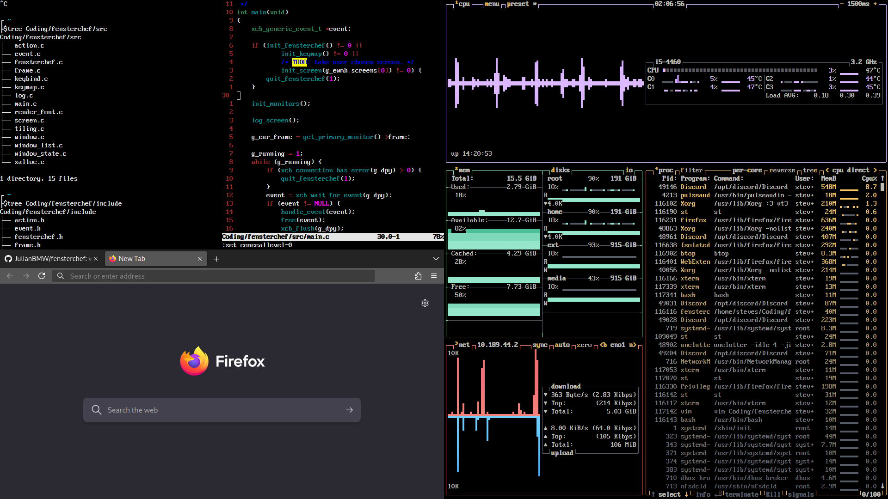
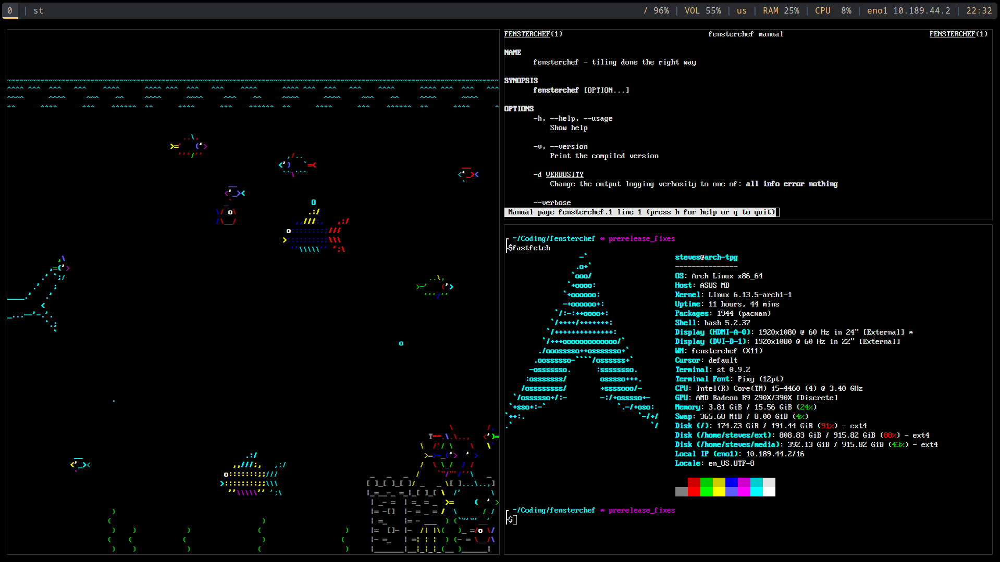

# Fensterchef – The X11 Tiling Window Manager for Linux

Fensterchef is a lightweight, lightning-fast window manager for Linux, focused on manual tiling.

🔹 **Manual Tiling**: Arrange your windows exactly how you want — no rigid grids or enforced layouts. </br>
🔹 **Lightweight & Fast**: Minimal overhead ensures smooth performance, even on low-end hardware. </br>
🔹 **Highly Customizable**: Configure Fensterchef easily with a simple configuration file. </br>
🔹 **Keyboard-Centric**: Navigate your workspace effortlessly with intuitive shortcuts. </br>
🔹 **Modern C++ Architecture**: Completely restructured with true OOP design and modern C++17. </br>

## Recent Architectural Overhaul 🎉

Fensterchef has been **completely restructured** with a modern C++ architecture featuring:
- **Modular Design**: 7 clearly defined modules (core, window, layout, display, input, x11, utils)
- **True OOP**: Proper encapsulation with private data and public interfaces
- **No Globals**: All state managed through Application class
- **Smart Pointers**: Automatic memory management with `std::unique_ptr`
- **Type Safety**: Strong typing with `enum class` and `constexpr`
- **Clean Code**: Single responsibility, dependency injection, RAII throughout

See [ARCHITECTURE.md](ARCHITECTURE.md) for details on the new design.
See [RESTRUCTURING_SUMMARY.md](RESTRUCTURING_SUMMARY.md) for before/after comparison.

## Gallery




## Installation

Get started immediately! Open a terminal and clone the repository:
```sh
git clone https://github.com/JulianBMW/fensterchef.git
```
Then simply type the following and enter your password.
```sh
sudo make install
```

Now you have the **fensterchef** executable (`/usr/bin/fensterchef`)
and the manual page (`/usr/share/man/man1/fensterchef.1.gz`).

If you are using a login manager, you can simply put this at the end of your `~/.xsession`:
```
mkdir -p ~/.local/share/fensterchef
exec /usr/bin/fensterchef -dinfo 2>~/.local/share/fensterchef
```
Alternatively put it this into the `~/.xinitrc`.

*How to get fensterchef to run exactly varies on your environment.*

## Architecture

Fensterchef now features a **modern, modular C++ architecture**:

```
src/
├── core/          # Main application coordination
├── window/        # Window management (Window, WindowManager)
├── layout/        # Tiling layout (Frame, TilingManager)
├── display/       # Monitor and rendering (Monitor, DisplayManager, Renderer)
├── input/         # Input handling (InputHandler, KeyMap, Actions)
├── x11/           # X11 integration (X11Connection, X11Atoms)
└── utils/         # Utilities (Logger, Geometry, StringUtils)
```

**Key Features:**
- **True OOP**: Private data members, public interfaces, proper encapsulation
- **No Global Variables**: All state owned by Application class
- **Smart Pointers**: Automatic memory management with `std::unique_ptr`
- **Modern C++17**: RAII, STL containers, strong typing with `enum class`
- **Modular Design**: Clear separation of concerns with single responsibility

For detailed architecture documentation, see:
- [ARCHITECTURE.md](ARCHITECTURE.md) - Detailed design documentation
- [RESTRUCTURING_SUMMARY.md](RESTRUCTURING_SUMMARY.md) - Before/after comparison

## Development

### Building from Source

```sh
git clone https://github.com/DevByProxy/fensterchef.git
cd fensterchef
make
sudo make install
```

### Code Organization

The codebase is organized into modules, each with a specific purpose:
- **Core Module**: Application lifecycle and coordination
- **Window Module**: Window lifecycle and management
- **Layout Module**: Tiling layout algorithms
- **Display Module**: Monitor management and rendering
- **Input Module**: Event handling and key bindings
- **X11 Module**: X11 protocol integration
- **Utils Module**: Common utilities and types

## Bugs

Report any issues directly to us over the Github issues tab.

An issue should start with the version, the rest is up to you. Try to add steps
to reproduce and the relevant excerpts from the log.
